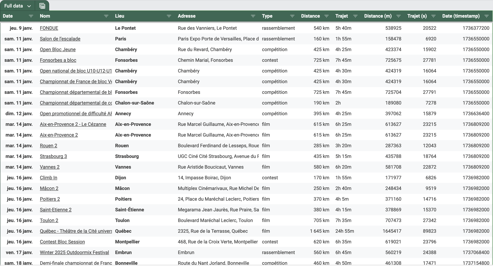
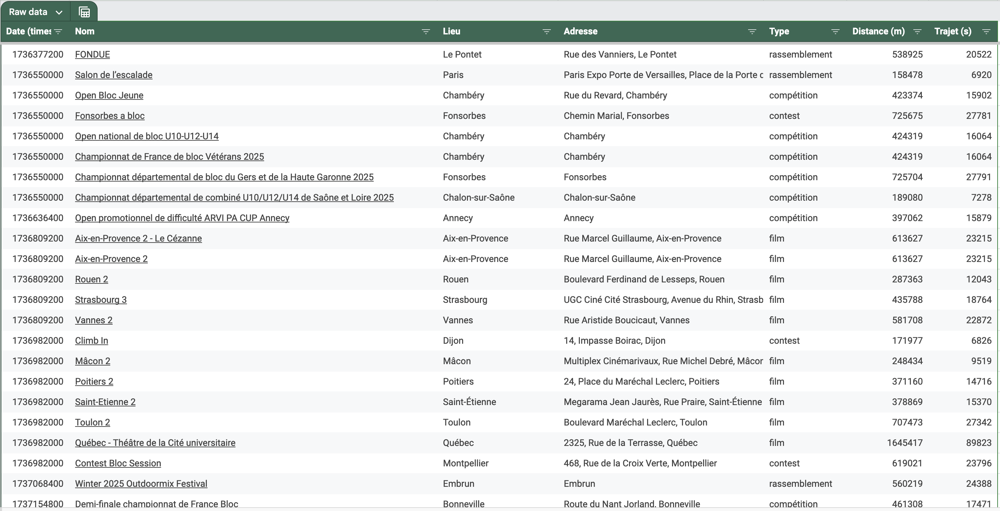
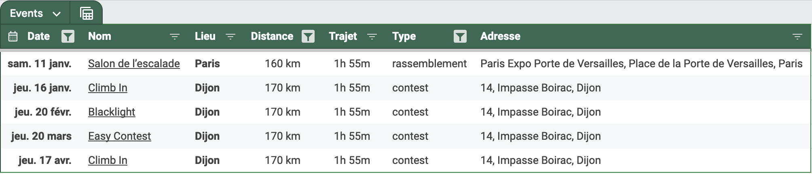

[![Build][github-ci-image]][github-ci-link]
[![Coverage Status][codecov-image]][codecov-link]
![License][license-image]

# Cartagrimpe Filter

Use Cartagrimpe data to find climbing events near you and export them in Google Spreadsheet.



## 🏃 How to use?

Duplicate [this](https://docs.google.com/spreadsheets/d/1BgeKD8rEr9TV1p7V9vni8stgSki1cl_eqcVxebXTfSo/edit?gid=1168437626#gid=1168437626) spreadsheet in your google drive.

In the main script `src/cartagrimpe_filter/main.py`, set `BASE_ADDRESS` to the address you want distances to be computed from, and `G_SHEET_KEY` to the url key of your duplicated spreadsheet.

Then execute the main script:

```python
python src/cartagrimpe_filter/main.py
```

To enable automatically updating the google spreadsheet, follow the [guide to authenticate as end user](https://docs.gspread.org/en/latest/oauth2.html#for-end-users-using-oauth-client-id).

## 📸 Screenshots <!-- omit from toc -->

<details>
  <summary>Click to expand screenshots</summary>

### Raw Spreadsheet



### Formatted


### Filtered Events (distance, time, date, event type, etc)



</details>

<!-- Links -->
[github-ci-image]: https://github.com/Kajiih/cartagrimpe_filter/actions/workflows/build.yml/badge.svg?branch=main
[github-ci-link]: https://github.com/Kajiih/cartagrimpe_filter/actions?query=workflow%3Abuild+branch%3Amain

[codecov-image]: https://img.shields.io/codecov/c/github/Kajiih/cartagrimpe_filter/main.svg?logo=codecov&logoColor=aaaaaa&labelColor=333333
[codecov-link]: https://codecov.io/github/Kajiih/cartagrimpe_filter

[license-image]: https://img.shields.io/badge/license-MIT_license-blue.svg?labelColor=333333
